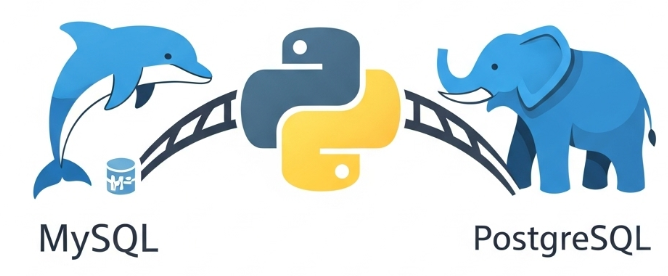

# Django MySQL to PostgreSQL Data Porter (`db-porter`)

A simples, interactive command-line tool to migrate data from a MySQL database to PostgreSQL for Django projects, preserving primary keys and handling complex dependencies.




[](https://github.com/BrunoAlz/django-mysql-to-postgres)


---

## The Problem

Migrating a live Django application's database from MySQL to PostgreSQL can be a complex and error-prone process. Standard tools like `pgloader` may not correctly handle Django's specific content types, and using `dumpdata`/`loaddata` often fails with circular dependencies or mishandles timezone-aware datetimes.

This tool was born from a real-world migration challenge and is designed to automate and simplify this entire process using Django's own ORM, ensuring data integrity.

## Key Features

- **Interactive CLI:** A user-friendly command-line interface that guides you through the process.
- **Intelligent Setup:** Automatically detects your Django project settings and source database, reducing manual configuration.
- **Intelligent Dependency Analysis:** Performs a topological sort on your models to determine a safe, multi-stage migration order.
- **Circular Dependency Handling:** Includes an `--ignore-cycles` mode to generate a best-effort plan for projects with inescapable circular dependencies.
- **Data Integrity:** Preserves all primary keys, timestamps (`auto_now`, `auto_now_add`), and relationships.
- **Robust & Safe:** Cleans destination tables before migration, re-enables database constraints, and resets primary key sequences upon completion.
- **Human-Readable Plans:** Generates a `migration_plan.md` file so you can review the migration order before executing.

## Usage Workflow

The process involves a one-time preparation of your databases, followed by two simple commands in the tool.

### ⚠️ Important: Prerequisites

Before using `db-porter`, you **must** prepare your destination database. This ensures that all tables, columns, and constraints match your Django models perfectly.

1.  **Create Destination Database:** Create a new, empty PostgreSQL database.
2.  **Create Schema:** Temporarily point your Django project's `settings.py` to this new PostgreSQL database and run the migrate command to create the entire table structure.
    ```bash
    python manage.py migrate
    ```
3.  **Reconnect to Source:** **Crucially**, change your `settings.py` back to connect to your original **MySQL** database. Your project must be pointing to the source data before you proceed.

---

### Step 1: Installation

Install the package and its required drivers within your Django project's virtual environment.

```bash
# Install the tool and the necessary database drivers
pip install django-mysql-to-postgres psycopg2-binary mysqlclient
```

### Step 2: Analyze Your Project

Navigate to your Django project's root directory (the one with `manage.py`) and run the `analyze` command.

```bash
db-porter analyze
```

- The tool will auto-detect your project and its settings.
- It will analyze all model dependencies and create two files:
  - `migration_plan.json`: A machine-readable migration order.
  - `migration_plan.md`: A human-readable, grouped plan for you to review.

If you have circular dependencies, the command will fail safely. You can generate a "best-effort" plan by using the `--ignore-cycles` flag:

```bash
db-porter analyze --ignore-cycles
```

### Step 3: Execute the Migration

Once you are satisfied with the plan, run the `migrate` command.

```bash
db-porter migrate
```

- The tool will **auto-detect your source MySQL database** from your project's settings.
- It will then interactively ask for the **Destination (PostgreSQL)** database credentials.
- It will show you a final confirmation summary.
- Upon confirmation, it will clean the destination tables and migrate all data, showing a live progress bar.

After the process is complete, simply point your Django project's `settings.py` to the PostgreSQL database to start using it.

## License

This project is licensed under the MIT License - see the [LICENSE](LICENSE) file for details.

## Contributing

Contributions, issues, and feature requests are welcome!
